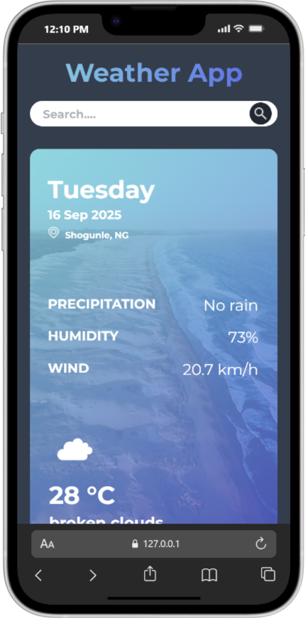

# Weather App

A responsive weather application built with HTML, CSS, and JavaScript. This app allows users to search for current weather information for any location worldwide.

## Features
- Search for weather by city name
- Displays temperature, weather conditions, and sunlight info
- Responsive design for mobile and desktop
- Modern UI with custom images and gradients

## Screenshots


## Getting Started
1. **Clone the repository:**
   ```sh
   git clone https://github.com/Dev-Ike/Weather_App.git
   ```
2. **Open `index.html` in your browser.**

## Project Structure
```
index.html
LICENSE
script.js
styles.css
images/
    gradient.png
    hero-img.png
    location.png
    search.png
    sunlight.png
```

## Technologies Used
- HTML5
- CSS3
- JavaScript (ES6)

## License
This project is licensed under the terms of the LICENSE file in this repository.

## Author
- [Dev-Ike](https://github.com/Dev-Ike)
